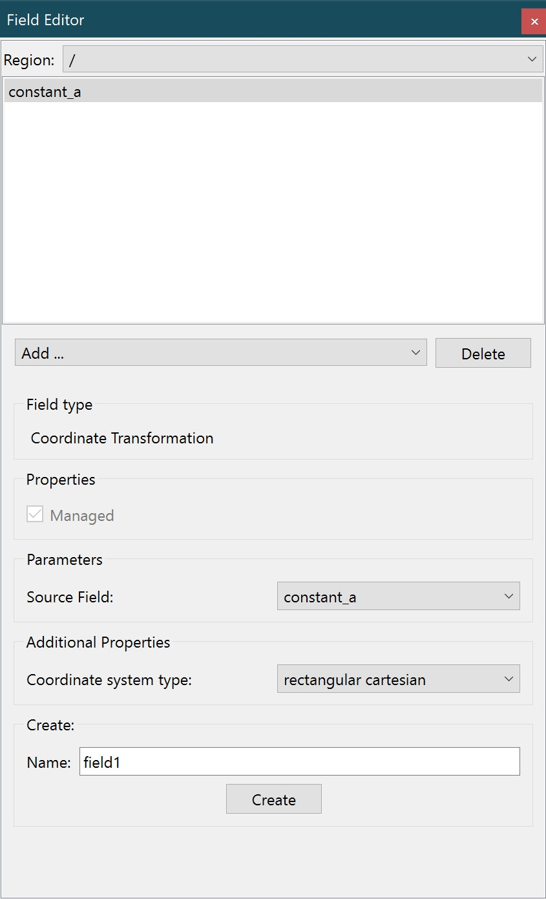

.. _Field-Editor-Widget:

===================
Field Editor Widget
===================

The **Field Editor Widget** is a control to add, remove, and modify fields in a region.

Fields are functions mapping locations in a model to values (real, mesh location, string etc.).

While interpolated finite element type fields and group fields (defining subdomains) are read from model files, all other field types can be created with this editor by selecting the function (math or other operator) and its arguments (the existing fields and other parameters it is a function of).

.. _fig-cmlibs-widgets-field-editor-widget:

   Field editor widget.

Field list
----------

Above the field list, there's a region chooser.

The field list shows all defined fields in the selected region. Double clicking on a field allows it to be renamed, provided the new name is not already in use.

Below the field list, two buttons allow you to add new field or delete the selected field.

Clicking on Add brings up a control for selecting the type/function of the new field, and once selected the controls for setting is required source fields and arguments are shown.

Clicking on Delete marks a field as unmanaged but won't necessarily remove it if it's still in use.

Settings editor
---------------

The settings editor is where each field is set up.

It contains a number of controls.

* Field type: This shows the field type of the current field.
* Managed checkbox: This checkbox allows you to set if the field is managed. An unmanaged field is automatically destroyed when unused by other fields, graphics or other objects.
* Is Coordinate checkbox: This checkbox allows you to set if the field is a coordinate. This is only supported by finite element fields.
* Coordinate system type and focus: This drop-down menu allows selection of the coordinate system type of the current field, which affects how it is drawn by graphics; polar coordinates systems such as cylindrical and spherical are converted to rectangular cartesian coordinates for display, using a temporary *coordinate transformation* field. The focus is a positive real value scaling prolate and oblate spheroidal coordinate systems only.
* Focus: This text box shows the focus number.
* Parameters. This lists source fields, real values, component numbers etc. which must be set before the new field is created.
* Name: This text box is only displayed when creating a new field, and allows you to set the name of the new field.

The *Create* button must be clicked to complete creation of a new field.

API
---

.. autoclass:: cmlibs.widgets.fieldeditorwidget.FieldEditorWidget
   :members:
