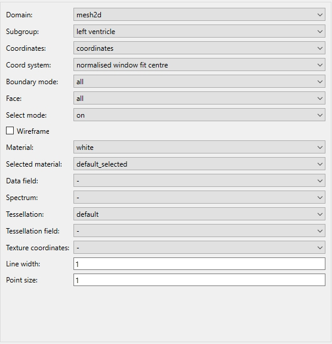

.. _Graphics-Editor-Widget:

======================
Graphics Editor Widget
======================

The **Graphics Editor Widget** is where each graphical setting can be edited. 
When a graphical setting is selected from the list, all of its editable properties appear in this area. 
The range of editable properties will vary depending on the type of graphics currently selected.

.. _fig-cmlibs-widgets-graphics-editor-widget:

   Graphics editor widget.

This widget usually been used with Scene Editor Widget, the content changes depending on the type of graphics selected in graphic list on Scene Editor Widget.

.. _curl: http://www.math.umn.edu/~nykamp/m2374/readings/divcurl/

General description of graphics
-------------------------------

graphics are the building blocks used to create any visualization displayed in the :ref:`sceneviewer widget <Sceneviewer-Widget>`. 
They are created, edited, re-ordered and deleted from within the :ref:`scene editor widget <Scene-Editor-Widget>`, or via the command line. Most graphics have the following settings in common:

* Coordinate field: This setting has a drop-down menu showing a list of fields that can be selected as the coordinate field for the selected graphic.

* Coordinate System: This setting can be used to render the graphic according to a range of different coordinate systems. This is useful for creating "static" overlays of data on visualizations.

* Boundary mode: This drop-down menu allows you to select a boundary, and automatically only render glyphs on the select boundary of a mesh.

* Select mode: This drop-down menu allows you to select different selection behaviours for the graphic:

  * select_on - The default setting; graphics are able to be selected and selected items are highlighted by rendering in the *default_selected* material.
  * no_select - No selection or highlighting of the graphic.
  * draw_selected - only selected items are drawn.
  * draw_unselected - only unselected items are drawn.

* Wireframe: This checkbox will control whether only the wireframe of the mesh is rendered.

* Material: This drop-down menu allows you to select which material should be used to render the graphic. Materials are defined and edited in the :ref:`material editor Widget <Material-Editor-Widget>`.

* Selected material: This drop-down menu allows you to set which material will be used to render parts of the graphic which are selected.

* Data: This setting has a drop-down menu, allowing you to select which field will be mapped on to the graphic. This enables you to colour the graphic according to the values of some field, for example. The check box also activates the *spectrum* drop-down menu.

* Spectrum: This drop-down menu is used to select which spectrum is to be used to colour the graphical element according to the field selected in the *data* setting. Spectra are edited in the :ref:`spectrum editor widget <Spectrum-Editor-Widget>`.

* Tessellation: Tessellation settings are used to set the level of detail of an object.

.. note::

   The only graphics which do not have a tessellation setting are *node points*, *data points*, and *point*.

* Tessellation field: This setting has a drop-down menu showing a list of fields that can be selected as the tessellation field for the selected graphic.

* Line width: This line editor allows you to set render line width.

* Point size: This line editor allows you to set render point size.

.. _types-of-graphics:

The types of graphics
---------------------

* **point**

  Point graphics are used to add a single glyph to the scene. 

  * **node points**

    Node points are used to visualize nodes. You can use glyphs to represent node points. There are a range of built-in glyphs in Zinc, and it is possible to create custom glyphs as well. 
    *Node points* graphics have the following settings in addition to the common ones listed above:

  * **data points**

    Data points are used to visualize data points. Like node points, they can be represented using glyphs. 
    They have the same settings as *node points*.

  * **element points**

    Element points are used to visualize the discretized points within an element. Elements may be 1, 2 or 3 dimensional, in which case the element points are spaced along the line, across the surface, or throughout the volume according to the chosen *tessellation* object . They have the following specific settings:

* **lines**

  Lines are used to visualize 1D elements, or the edges of 2D or 3D elements. They are simple, unshaded lines that have a fixed, specified width. They have the following specific settings:

* **contours**

  Contours are used to visualize the same things as lines. They are shaded contours of a specified radius. They have the following specific settings:

* **surfaces**

  Surfaces are used to visualize 2D elements or the faces of 3D elements. They are shaded surfaces of zero thickness that are automatically shaped according to the nodes defining the element they represent. Their level of detail is specified per surface by choosing a *tessellation* object. They have the following specific settings:

* **streamlines**

  Streamlines are a special graphic for visualizing *vector* fields - for example, a fluid flow solution. They can be used to visualize 3, 6 or 9 component vector fields within a 3 dimensional element. 
  Streamlines will align along their length according to the first vector of a vector field, and across their "width" (eg the width of the *ribbon* or *rectangle* streamline types) to the second vector. 
  For single vector (3 component) vector fields, the width of the streamlines will align to the curl_ of the vector.

  Note that streamlines can be quite expensive to compute; changes to streamline settings in the :ref:`scene editor <Scene-Editor-Widget>` can take several seconds to appear in the 3D window, especially for complex scenes.
