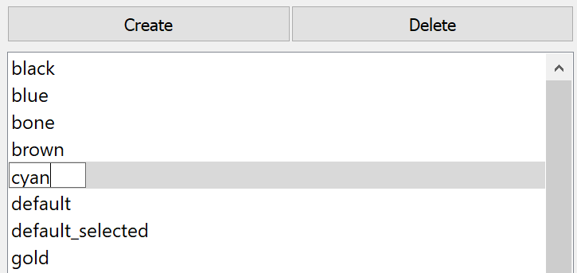
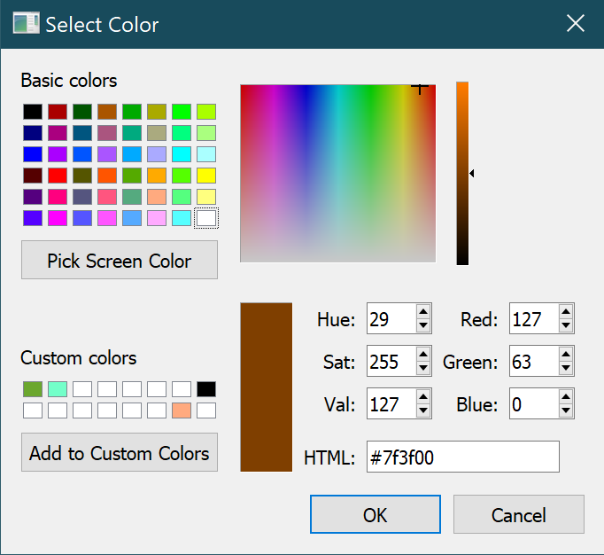

.. _Material-Editor-Widget:

======================
Material Editor Widget
======================

The material editor window is where you define materials to be applied to graphical elements or objects in the graphics window.  

.. _fig-opencmiss-zincwidgets-material-editor-widget:

.. figure:: _images/material-editor-widget.png
   :alt: Material editor widget.
   :width: 75%

   Material editor widget.

Material list
-------------

Along the top of the material editor window are two buttons; create and delete.  You can create a new material, or delete an existing material using these buttons.  

Below these buttons is the list of currently defined materials.
These will contain the default materials, as well as any defined in any comfile that has been run.

You can rename the material by double click it.

   Rename material.

Controls
--------

Below the material list is a panel containing four colour select buttons. These control the ambient, diffuse, emitted and specular colours.

* Ambient - The ambient colour is the "unlit" colour, or the colour of parts of the object that are in shadow.
* Diffuse - This is the overall colour of the material, the colour that the lit parts of the object will appear.
* Emitted - The emitted colour is the "glow" of a material; this colour will appear in both the lit and unlit parts of the material.
* Specular - This is the colour of the shine that appears on the material.  This shine appears as a glossy highlight.

   Select colour.

When you click the Select Colour button, a colour dialog will pop up, and you can select a colour in several ways. The background of these four buttons indicates the colour you choose.

Below the colour editors is the surface editor.  This panel allows you to set the alpha, shininess, and texture properties of the surface of the material being edited.  
The alpha value sets the transparency of the material.  The shininess sets the "tightness" or size of the specular highlights of a material; generally the higher the shininess, the smaller and harder-edged the highlights.  
Higher shininess makes a material look glossier.  
The surface editor also allows you to assign a texture to the material surface - this option is unavailable for now.

Preview panel
-------------

Below the surface editor is a panel that shows a preview of the currently edited material applied to a sphere. 
This panel displays a sphere, shaded with the selected material.
