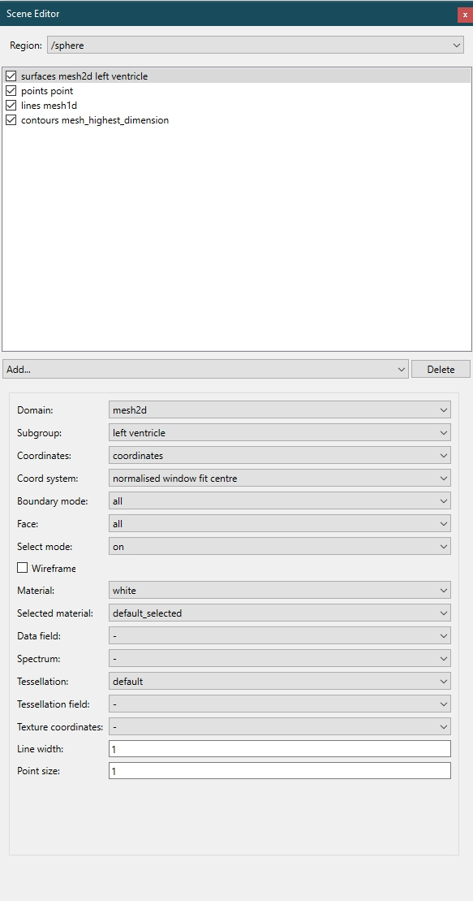

.. _Scene-Editor-Widget:

===================
Scene Editor Widget
===================

The **Scene Editor Widget** is a control to add, remove, and modify the graphics of a scene.

.. _fig-cmlibs-widgets-scene-editor-widget:

   Scene editor widget.

Graphics list
-------------

Along the top of the scene editor window is a region selector that allows you to select the region of current scene.

Below the selector is the list of currently defined graphics.
The graphics list displays all the defined graphics in the current scene, each with a checkbox in front of it. 
This checkbox allows you to set whether to display this graphic.
This graphics list can also be reordered via drag and drop. Graphics at the top have higher display priority.
Earlier graphics are rendered first, which can affect translucency results in some modes.
The graphics in the list are labeled by the graphics type followed by the domain and optionally the subgroup. The domain and subgroup can be changed in the graphics editor below.

Below the list of graphics, there is a drop-down menu that allows addition of new graphics of specified type (with convenient *points* sub-types *point, node points, data points* and *elements points* which also set the domain), and a button to *Delete* the currently selected graphics.

Graphics editor
---------------
Below the graphics list is the graphics editor where settings for each graphics can be edited.
The range of settings displayed varies depending on the :ref:`type of graphics <types-of-graphics>` currently selected and sometimes also the *Domain type*.

API
---

.. autoclass:: cmlibs.widgets.sceneeditorwidget.SceneEditorWidget
   :members: